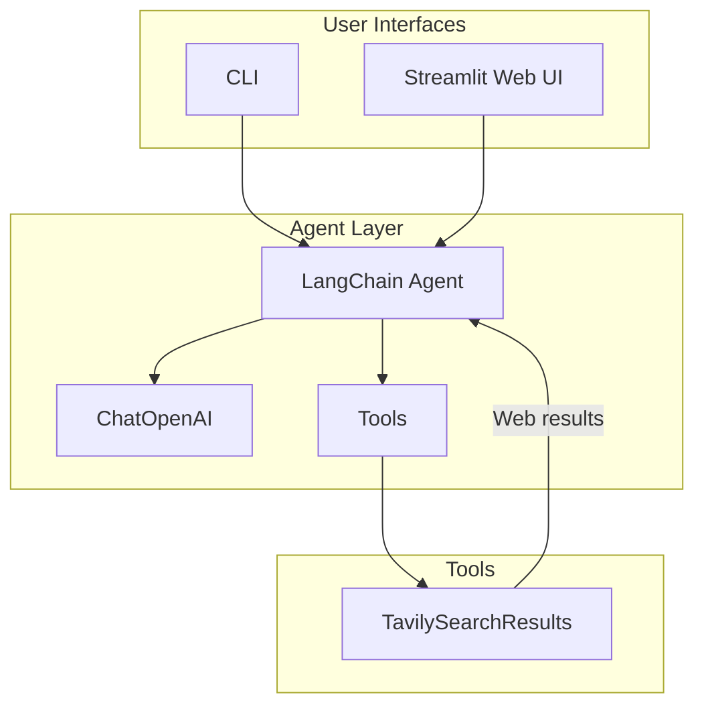

# AI Web Search Agent with LangChain, OpenAI, and Tavily

## Architecture Overview




## Tech Stack


| Component       | Choice                                                  |
| --------------- | ------------------------------------------------------- |
| LLM             | `langchain-openai` (ChatOpenAI)                         |
| Search Tool     | `langchain-tavily` (TavilySearchResults)                |
| Agent Framework | LangChain `create_tool_calling_agent` + `AgentExecutor` |
| Web UI          | Streamlit                                               |
| Config          | `python-dotenv` for API keys                            |


## Project Structure

Create under [AI search Agent](c:\Tranining\WIP_Coding\langchain-course\AI search Agent:

```
AI search Agent/
├── .env                    # OPENAI_API_KEY, TAVILY_API_KEY
├── .gitignore
├── requirements.txt
├── README.md
├── agent.py                # Core agent logic (reusable)
├── cli.py                  # CLI entry point
└── app.py                  # Streamlit web app
```

## Implementation Plan

### 1. Project Setup

- **requirements.txt**: `langchain`, `langchain-openai`, `langchain-tavily`, `python-dotenv`, `streamlit`
- **.env**: `OPENAI_API_KEY` (required), `TAVILY_API_KEY` (required for search)
- **.gitignore**: `.env`, `__pycache__`, `.venv`

**Tavily API key**: Free tier at [tavily.com](https://tavily.com) — 1,000 searches/month.

### 2. Core Agent ([agent.py](c:\Tranining\WIP_Coding\langchain-course\AI search Agent\agent.py))

- Define system prompt for a web search assistant (search, synthesize, cite sources)
- Instantiate `ChatOpenAI` (e.g., `gpt-4o-mini` for cost efficiency)
- Add `TavilySearchResults` tool with configurable `max_results` (e.g., 5)
- Use `create_tool_calling_agent` + `AgentExecutor` pattern
- Expose `search(query: str) -> str` function that invokes the agent and returns the answer

### 3. CLI ([cli.py](c:\Tranining\WIP_Coding\langchain-course\AI search Agent\cli.py))

- Load `.env`, validate `OPENAI_API_KEY` and `TAVILY_API_KEY`
- Interactive loop: prompt user for query, call `search()`, print result
- Support `--query "..."` for single-shot mode
- Graceful handling of missing keys with clear error messages

### 4. Streamlit Web UI ([app.py](c:\Tranining\WIP_Coding\langchain-course\AI search Agent\app.py))

- Title and text input for search query
- "Search" button triggers agent invocation
- Display answer in a styled response area
- Optional: show loading spinner during search
- Run with `streamlit run app.py`

### 5. README

- Setup instructions (venv, pip install, env vars)
- How to run CLI vs web app
- Link to get Tavily API key

## Key Code Patterns

**Agent creation** (LangChain pattern):

```python
from langchain_openai import ChatOpenAI
from langchain_tavily import TavilySearchResults
from langchain.agents import create_tool_calling_agent, AgentExecutor
from langchain_core.prompts import ChatPromptTemplate, MessagesPlaceholder

tools = [TavilySearchResults(max_results=5)]
llm = ChatOpenAI(model="gpt-4o-mini", temperature=0)
prompt = ChatPromptTemplate.from_messages([
    ("system", "You are a helpful web search assistant..."),
    MessagesPlaceholder(variable_name="chat_history", optional=True),
    ("human", "{input}"),
    MessagesPlaceholder(variable_name="agent_scratchpad"),
])
agent = create_tool_calling_agent(llm, tools, prompt)
agent_executor = AgentExecutor(agent=agent, tools=tools, verbose=True)
```

## Dependencies

Reuse existing [Hello world/.env](c:\Tranining\WIP_Coding\langchain-course\Hello worldenv) pattern; user will add `TAVILY_API_KEY` to `.env` in the new project folder.

## Alternative: SerpAPI

If user prefers SerpAPI (250 free searches/month), swap `langchain-tavily` for `google-search-results` and use `SerpAPIWrapper` from `langchain_community`. The plan structure remains the same; only the tool import and initialization change.